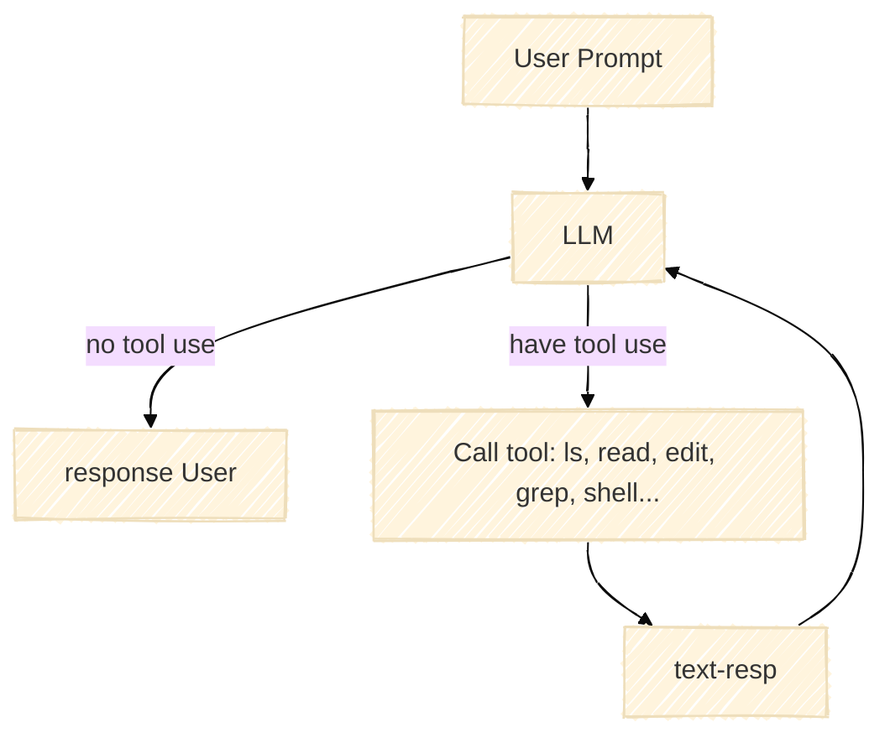

```mermaid
---
config:
  theme: base
  look: handDrawn
---
flowchart TD
    A[User Prompt] --> B[LLM]
    B -->|no tool use| C[response User]
    B -->|have tool use| D[Call tool: ls, read, edit, grep, shell...]
    D --> E[text-resp]
    E --> B

```

### install

```bash
npm install -g wscode-cli
```

### open

```bash
export OPENROUTER_KEY=your_openrouter_api_key
wscode-cli
```

### build

```bash
pnpm run build
```
